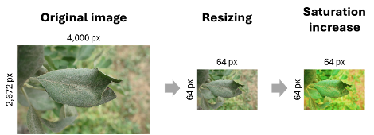
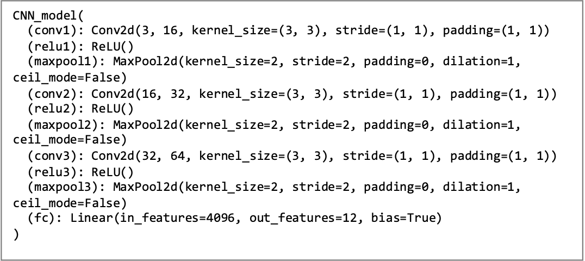
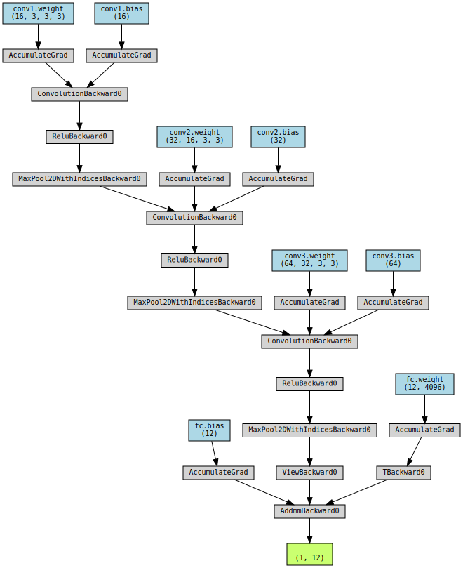

# FGVC8: Foliar Disease Classification - Plant Pathology

## Overview

This project is part of the Plant Pathology 2021 - FGVC8 Kaggle competition, which aims to develop machine learning models for the automated identification and classification of foliar diseases in apple trees. The project leverages computer vision techniques to address the challenges of manual disease diagnosis, which is both time-consuming and costly.

## Abstract

The project utilizes a convolutional neural network (CNN) architecture, inspired by SAYANTIKA NAG's model, to classify leaf images into specific disease categories. Key modifications were made to adapt the model for local GPU training, including reducing image size, increasing saturation, and simplifying the architecture. Despite achieving an accuracy of 30.65%, the project provides valuable insights into the importance of data quantity, model complexity, and iterative development for enhancing disease diagnosis.

## Problem Definition

The competition presents a dataset of approximately 23,000 high-quality RGB images of apple foliar diseases. The goal is to develop models that can accurately classify leaf images and identify individual diseases amidst multiple symptoms. Challenges include variations in visual symptoms across cultivars and environmental factors.

## Methods

### Data Preprocessing

- **Image Resizing**: Images are resized to 64x64 pixels to reduce computational complexity.   
- **Saturation Increment**: Image saturation is increased to enhance color variation.

### Model Architecture

- **Convolutional Neural Network (CNN)**: The model consists of three convolutional layers with ReLU activation and max-pooling, followed by a fully connected layer.

### Training Process

- **Dataset Splitting**: The dataset is split into training, validation, and test sets.
- **Focal Loss Function**: Used to address class imbalance.
- **Adam Optimizer**: Employed with a learning rate of 0.001.
- **Batch Size**: Increased to 2048 for efficient GPU utilization.

## Results

The model achieved an accuracy of 30.65%, which is lower than the top performers on the Kaggle leaderboard. Factors affecting performance include limited data, simplified architecture, and class imbalance.

Table 1: Performance Metrics
| Metric | Value |
|--------|-------|
| Accuracy | 0.3065 |
| Precision | 0.0939 |
| Recall | 0.3065 |
| F1 Score | 0.1438 |

## Lessons Learned

1. **Data Quantity and Quality**: Essential for robust model training.
2. **Model Complexity vs. Resources**: Balance is crucial for performance.
3. **Continuous Iteration**: Necessary for identifying effective approaches.

## Conclusion

While the project did not achieve state-of-the-art performance, it provides a foundation for future advancements in plant pathology diagnosis. Future work should focus on dataset augmentation, exploring sophisticated architectures, and refining training techniques.

## References

1. Thapa, Plant Pathology 2021 - FGVC8. Kaggle.